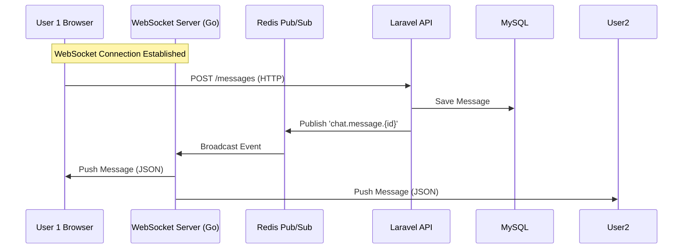

# Laravel + Go Realtime Chat SYSTEM

This project is a high-performance real-time chat application combining **Laravel** (API & DB), **Go** (WebSocket Server), and **Redis** (Pub/Sub).

## Overview

The system architecture is designed for scalability and speed:
- **Laravel 12**: Handles simple authentication, database interactions (MySQL), and business logic.
- **Go 1.22**: Serves as a lightweight, high-concurrency WebSocket server.
- **Redis**: Acts as the Pub/Sub middleware to bridge Laravel and Go.
- **Alpine.js & Tailwind**: Provides a reactive, modern frontend without heavy SPA frameworks.

## Features

### Core Messaging
- **Real-time Communication**: Messages are delivered instantly (< 100ms) via WebSockets.
- **Typing Indicators**: See when users are typing in real-time.
- **Conversation Management**: Create and switch between private or group conversations.
- **Message History**: Auto-scrolls to the latest messages; history is persisted in MySQL.

### UI/UX
- **Responsive Design**: Mobile-friendly layout using Tailwind CSS.
- **Real-time Updates**: Conversation list updates instantly when new messages arrive.
- **User Feedback**: Loading states, connection status (auto-reconnect mechanics), and send status.
- **Formatting**: Timestamps localized to Vietnamese format.

## Architecture



**Workflow**:
1.  **Frontend** sends a message via standard HTTP POST to Laravel.
2.  **Laravel** validates, saves to MySQL, and publishes an event to Redis.
3.  **Go Server** (subscribed to Redis) receives the event.
4.  **Go Server** broadcasts the payload via WebSocket to all connected clients in that conversation.

## 🔧 Tech Stack

**Frontend**
-   **Alpine.js v3**: Lightweight reactivity.
-   **Tailwind CSS v4**: Utility-first styling.
-   **Native WebSocket**: Zero-dependency connection management.

**Backend**
-   **Laravel 12 (PHP 8.5)**: Robust API and Eloquent ORM.
-   **Go 1.22**: Optimized for handling thousands of concurrent WebSocket connections.
-   **Redis**: High-speed message broker.
-   **MySQL**: Relational data storage.

## File Structure

```
laravel-go-socket/
├── laravel-app/
│   ├── app/Http/Controllers/Chat/  # Laravel Controllers
│   ├── resources/js/chat.js        # Main Alpine.js Chat Logic
│   └── resources/views/chat/       # Blade Views
├── go-realtime/
│   ├── cmd/server/main.go          # Go Entry Point
│   ├── internal/hub/               # Client & Room Management
│   └── internal/redis/             # Redis Subscriber & Parser
└── docker-compose.yml              # Container Orchestration
```

## Quick Start

### 1. Start Services
```bash
docker compose up -d
```

### 2. Setup Data (First Run)
```bash
# Enter PHP container
docker compose exec php php artisan tinker

# Create test data
$user1 = \App\Models\User::factory()->create(['name' => 'Alice', 'email' => 'alice@test.com']);
$user2 = \App\Models\User::factory()->create(['name' => 'Bob', 'email' => 'bob@test.com']);
$chatService = app(\App\Services\ChatService::class);
auth()->login($user1);
$chatService->createConversation([$user2->id], 'private');
```

3. **Access Application**:
    -   Open http://localhost:8080/chat
    -   Login as **Alice** (or Bob) to start chatting.

## Debug & Monitoring

**Check Go Server Logs** (Vital for connection issues):
```bash
docker compose logs -f go-realtime
```
*Expected: "Go Realtime Server running on :6001"*

**Check Redis Messages**:
```bash
docker compose exec redis redis-cli PSUBSCRIBE *chat.message.*
```

**Browser Debugging**:
-   Open DevTools -> Network -> WS (WebSockets) to inspect frames.
-   Open Console to see connection state logs.

## Planned Features
-   [ ] File & Image Uploads
-   [ ] Message Read Receipts
-   [ ] User Search & New Conversation UI
-   [ ] Infinite Scroll for History
-   [ ] Emoji Picker

---
**Status**: Production Ready for MVP
