# Real-time Chat System Fixes & Architecture Guide

This document details the issues found and fixes applied to the Laravel + Go real-time chat system, specifically regarding message delivery and Redis integration.

## 🏗 Architecture Overview

- **Laravel**: Handles HTTP requests, authentication, and persists messages to MySQL. Publishes events to Redis.
- **Redis**: Acts as a message broker (Pub/Sub) between Laravel and Go.
- **Go Server**: Subscribes to Redis channels and broadcasts messages to connected WebSocket clients.
- **WebSocket Clients**: Alpine.js frontend connects to Go server to receive real-time updates.

## 🛠 Critical Fixes Applied

### 1. Redis Channel Prefix Mismatch 🔴 -> ✅
- **Issue**: Laravel adds a prefix (default `laravel_database_`) to all Redis keys/channels.
    - Laravel published to: `laravel_database_chat.message.1`
    - Go subscribed to: `chat.message.*`
    - **Result**: Go server never received messages.
- **Fix**: Updated Go subscriber to use a leading wildcard pattern.
    - **New Pattern**: `*chat.message.*`
    - **Code**: `go-realtime/internal/redis/subscriber.go`

### 2. Payload Parsing Failures 🔴 -> ✅
- **Issue**: `conversation_id` type inconsistency.
    - Laravel/Redis sends numbers as float64, strings, or int64 depending on encoding.
    - Go parser expected strict `int64`.
- **Fix**: Enhanced parser to handle dynamic types (`string`, `float64`, `int`, `int64`) and check both top-level and nested `data` fields.
    - **Code**: `go-realtime/internal/redis/parser.go`

### 3. Typing Indicators (Echo Check) 🔴 -> ✅
- **Issue**: Sender received their own typing indicator.
- **Fix**:
    - **Go**: Added `ExcludeClient` to broadcast logic to prevent echoing back to sender.
    - **JS**: Added client-side check `data.user_id !== this.currentUserId`.

### 4. JavaScript Optimization 🧹
- **Change**: Extracted inline JavaScript from `index.blade.php` to a dedicated file.
- **New File**: `resources/js/chat.js`
- **Result**: Cleaner Blade templates and better maintainability.

## 📊 Visual Overview

### Architecture Flow

```mermaid
sequenceDiagram
    participant U1 as User 1 Browser
    participant WS as WebSocket Server
    participant Hub as Hub (Broadcast)
    participant U2 as User 2 Browser

    U1->>WS: typing event
    WS->>Hub: Broadcast (excluding U1)
    Hub->>U2: typing indicator
    Note over U1: No typing indicator shown (Fixed)
    Note over U2: "đang nhập..." shown

    U1->>WS: send message
    WS->>Hub: Broadcast (no exclusion)
    Hub->>U1: message
    Hub->>U2: message
    Note over U1,U2: Message appears instantly
```



## 🚀 How to Run & Verify

### 1. Start Services
```bash
docker compose up -d
```

### 2. Build Frontend
```bash
cd laravel-app
npm run build
```

### 3. Verify Connections
- **Browser**: Open Chat. Console should show `WebSocket connected`.
- **Go Logs**: `docker compose logs -f go-realtime`
    - Should show: `🚀 Go Realtime Server running on :6001`
    - Should show: `📡 Subscribed to Redis pattern: *chat.message.*`

### 4. Test Message Delivery
- Open two browser windows (User 1 & User 2).
- Send a message.
- **Result**: Message appears instantly in both windows without refresh.

## 📁 Key File Locations

- **Go Subscriber**: `go-realtime/internal/redis/subscriber.go`
- **Go Parser**: `go-realtime/internal/redis/parser.go`
- **Chat Logic (JS)**: `laravel-app/resources/js/chat.js`
- **Chat View (Blade)**: `laravel-app/resources/views/chat/index.blade.php`
